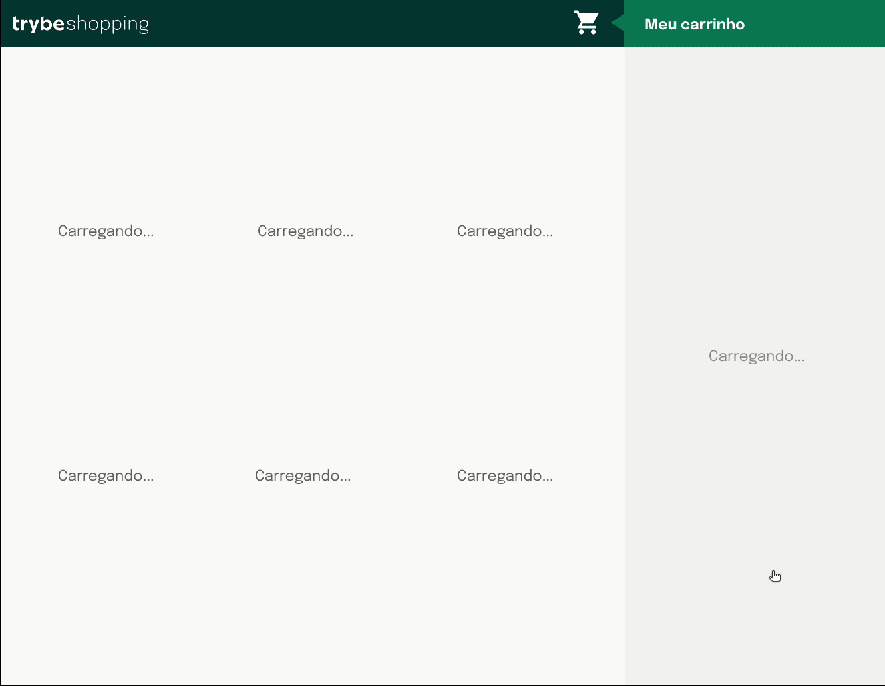

# Boas-vindas ao repositório do projeto Carrinho de Compras!

  
<strong>👨‍💻 O que eu desenvolvi</strong>
 

Eu desenvolvi um **carrinho de compras** totalmente dinâmico! 🛒

Para isso, esse foi o meu primeiro projeto que eu consumi os dados diretamente de uma **API!** 🤩

Isso mesmo! Da sigla em inglês _Application Programming Interface_, uma API é um ponto de contato na internet com determinado serviço e nesse projeto eu utilizei a API do Mercado Livre para buscar produtos à venda. 🏷

E não para por aí! 🤩

Você já sabe sobre a importância de ter uma mentalidade orientada a testes, não é mesmo? E também já sabe como a implementação de testes contribui para a escrita de códigos mais confiáveis e com boa performance. 

Nesse projeto eu coloquei em prática o desenvolvimento orientado a testes, o famoso TDD (Test Driven Development)! Que me ajuda a garantir um código de qualidade, percebendo os casos de uso da sua aplicação e garantindo que ela está funcionando da maneira correta! 🚀

eu finalizei o projeto, e ele teve o comportamento parecido com o gif abaixo:

 

<strong>Habilidades Adquiridas ao realizar este projeto</strong>
 

  Nesse projeto, eu fui capaz de:

  - Utilizar e aprimorar meus conhecimentos em javascript
  - Aprender a metodologia TDD
  - Utilizar jest
  - Utilização de API

 
link do projeto funcionando (https://robson-aires.github.io/shopping_cart/)
 
 

